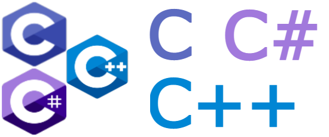

### Hi There!

My name is Brandon. I'm an senior at UNC Charlotte studying computer science and math. When I finish I will pursue a MS in computer science.

### Programming Languages

|   |   |   |    
|---|---|---|---|

### Contact

 
 

⭐️ From [btror](https://github.com/btror)

